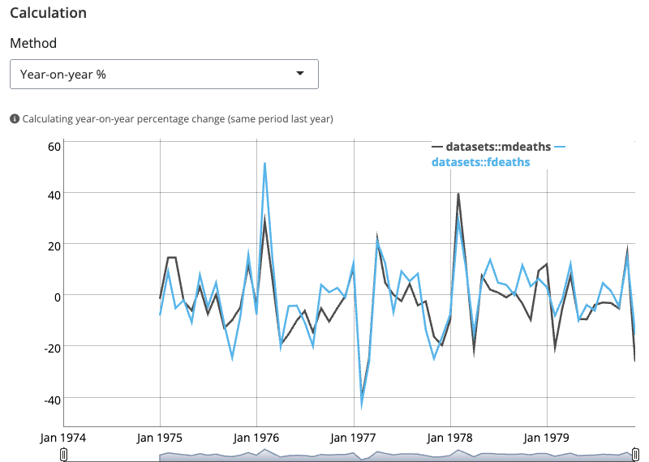
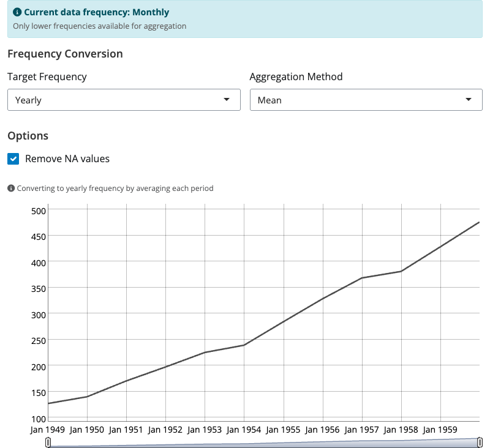
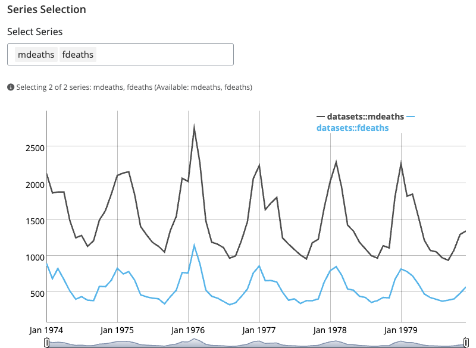
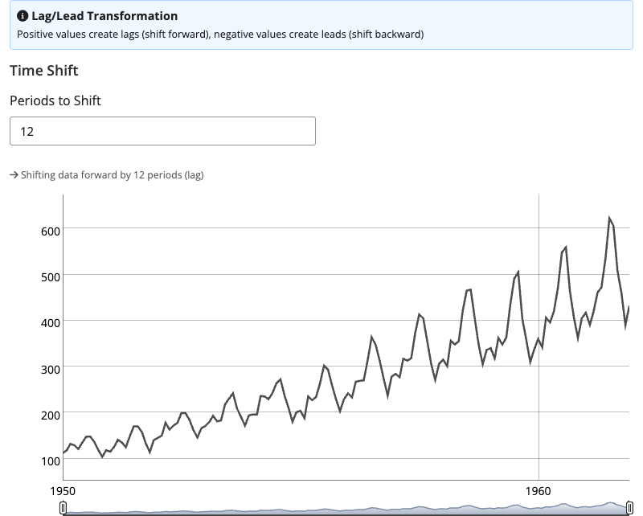
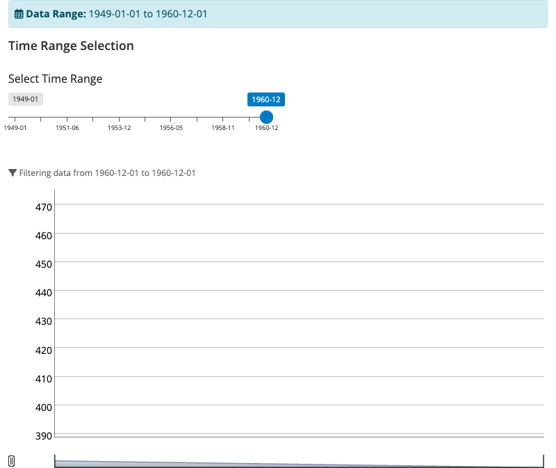
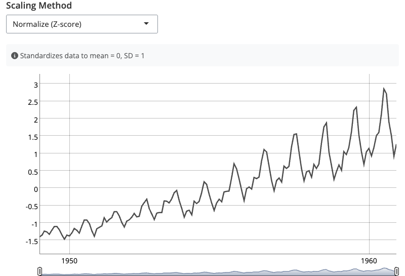
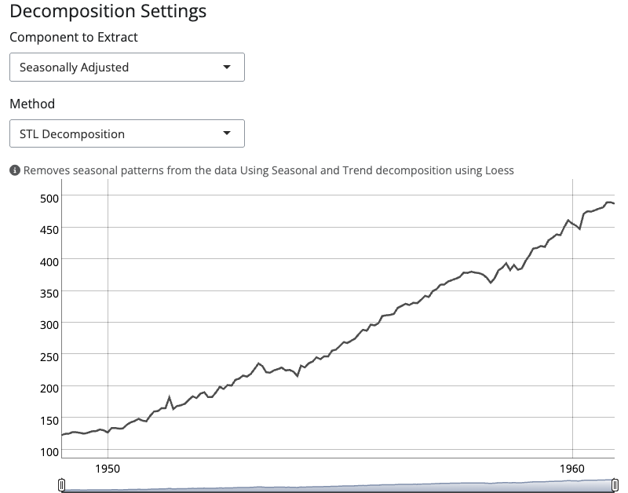
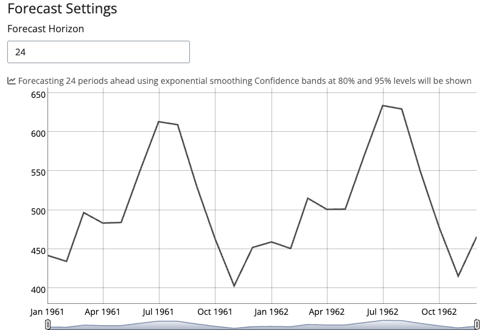
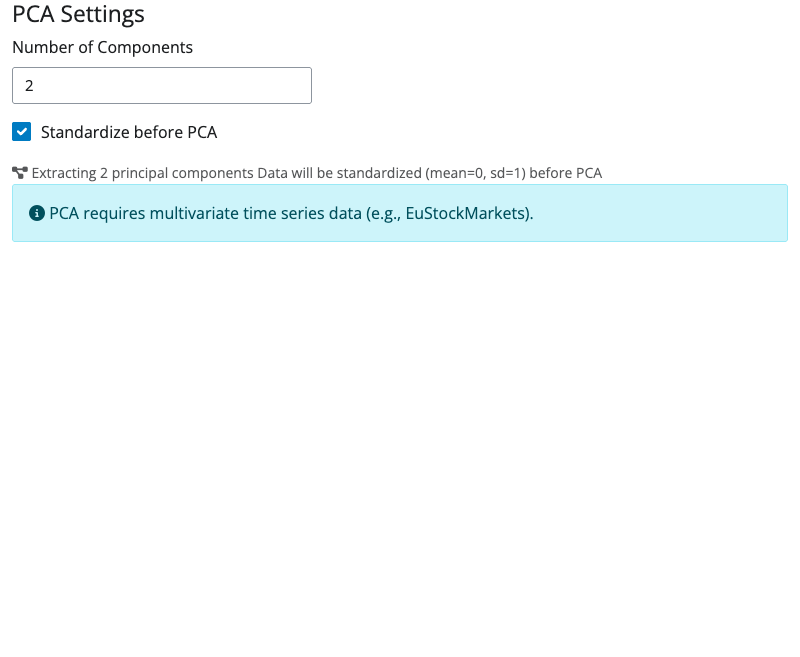

# blockr.ts

**Time Series Analysis Blocks for blockr**

Specialized time series functionality for blockr using tsbox and dygraphs. Provides comprehensive blocks for loading, transforming, and visualizing time series data as interactive dygraphs.

## Features

- 📊 **Interactive Dygraphs**: All outputs render as interactive time series charts
- 📦 **25 Built-in Datasets**: Easy access to R's time series datasets
- 🔄 **Comprehensive Transformations**: Changes, frequency conversion, lag/lead, scaling
- 📈 **Advanced Analysis**: Forecasting, decomposition, PCA for multivariate series
- 🎨 **Professional UI**: Consistent design following blockr.ggplot patterns
- 🎯 **tsbox Integration**: Seamless format conversion and manipulation

## Installation

```r
# Install dependencies
install.packages(c("tsbox", "dygraphs", "forecast"))

# Install blockr.core if not already installed
# remotes::install_github("blockr-org/blockr.core")

# Install blockr.ts
devtools::install()
```

## Quick Start

```r
library(blockr.core)
library(blockr.ts)

# Register blocks with blockr
register_ts_blocks()

# Start with a dataset and apply transformations
blockr.core::serve(
  new_ts_dataset_block(dataset = "AirPassengers"),
  new_ts_change_block(method = "pcy")
)
```

## Available Blocks

### Data Blocks

#### `new_ts_airpassenger_block()`
Classic AirPassengers dataset - a simple starting point for time series analysis.

```r
blockr.core::serve(new_ts_airpassenger_block())
```

#### `new_ts_dataset_block()`
Access all 25 built-in R time series datasets with an intuitive selector.

```r
blockr.core::serve(
  new_ts_dataset_block(dataset = "EuStockMarkets")
)
```

### Transform Blocks

#### `new_ts_change_block()`
Calculate various types of changes: percentage, differences, year-over-year.



```r
blockr.core::serve(
  new_ts_change_block(method = "pcy"),
  data = list(data = tsbox::ts_tbl(datasets::AirPassengers))
)
```

**Methods:**
- `pc`: Period-on-period percentage change
- `pcy`: Year-on-year percentage change
- `pca`: Annualized percentage change
- `diff`: First differences
- `diffy`: Year-on-year differences

#### `new_ts_frequency_block()`
Convert time series between temporal granularities with smart aggregation.



```r
blockr.core::serve(
  new_ts_frequency_block(to = "year", aggregate = "mean"),
  data = list(data = tsbox::ts_tbl(datasets::AirPassengers))
)
```

**Features:**
- Automatic frequency detection
- Smart target selection (only allows aggregation)
- Multiple aggregation methods: mean, sum, first, last, min, max

#### `new_ts_select_block()`
Select specific series from multivariate time series data.



```r
multivariate_data <- tsbox::ts_c(datasets::mdeaths, datasets::fdeaths)

blockr.core::serve(
  new_ts_select_block(series = "mdeaths"),
  data = list(data = tsbox::ts_tbl(multivariate_data))
)
```

#### `new_ts_lag_block()`
Shift time series forward (lag) or backward (lead).



```r
blockr.core::serve(
  new_ts_lag_block(by = 12),
  data = list(data = tsbox::ts_tbl(datasets::AirPassengers))
)
```

#### `new_ts_span_block()`
Filter time series to specific date ranges with an intuitive range slider.



```r
blockr.core::serve(
  new_ts_span_block(start = 1950, end = 1955),
  data = list(data = tsbox::ts_tbl(datasets::AirPassengers))
)
```

### Analysis Blocks

#### `new_ts_scale_block()`
Scale, normalize, or index time series for comparison.



```r
blockr.core::serve(
  new_ts_scale_block(method = "normalize"),
  data = list(data = tsbox::ts_tbl(datasets::AirPassengers))
)
```

**Methods:**
- `normalize`: Scale to mean=0, sd=1
- `index`: Index to base period (100)
- `minmax`: Scale to [0, 1] range

#### `new_ts_decompose_block()`
Extract trend, seasonal, and remainder components.



```r
blockr.core::serve(
  new_ts_decompose_block(component = "seasonal_adjusted"),
  data = list(data = tsbox::ts_tbl(datasets::AirPassengers))
)
```

#### `new_ts_forecast_block()`
Generate forecasts with confidence intervals.



```r
blockr.core::serve(
  new_ts_forecast_block(horizon = 24),
  data = list(data = tsbox::ts_tbl(datasets::AirPassengers))
)
```

#### `new_ts_pca_block()`
Principal Component Analysis for multivariate time series.



```r
blockr.core::serve(
  new_ts_pca_block(n_components = 2),
  data = list(data = tsbox::ts_tbl(datasets::EuStockMarkets))
)
```

## Building Pipelines

Combine blocks to create powerful analysis workflows:

```r
# Complete analysis pipeline
blockr.core::serve(
  new_ts_dataset_block(dataset = "AirPassengers"),
  new_ts_decompose_block(component = "seasonal_adjusted"),
  new_ts_change_block(method = "pcy"),
  new_ts_forecast_block(horizon = 12)
)

# Multivariate analysis
blockr.core::serve(
  new_ts_dataset_block(dataset = "EuStockMarkets"),
  new_ts_select_block(series = c("DAX", "FTSE")),
  new_ts_scale_block(method = "normalize"),
  new_ts_pca_block(n_components = 1)
)
```

## Direct Data Input

All transform blocks support direct data input for standalone use:

```r
# Create your own time series data
my_data <- list(
  data = tsbox::ts_tbl(
    ts(rnorm(100), frequency = 12, start = c(2020, 1))
  )
)

# Apply transformations
blockr.core::serve(
  new_ts_change_block(method = "pc"),
  data = my_data
)
```

## Interactive Features

All blocks output interactive dygraphs with:
- 🔍 **Pan & Zoom**: Click and drag to zoom, double-click to reset
- 📏 **Range Selector**: Drag handles to focus on specific periods
- 📍 **Hover Details**: See exact values and dates on hover
- 🎨 **tsbox Colors**: Professional color palette for multivariate series

## Development

### Creating Custom Blocks

Follow the established patterns for new blocks:

```r
# Data blocks inherit from ts_data_block
new_custom_data_block <- function(...) {
  new_ts_data_block(
    # Implementation
    class = "custom_data_block",
    ...
  )
}

# Transform blocks inherit from ts_transform_block
new_custom_transform_block <- function(...) {
  new_ts_transform_block(
    # Implementation
    class = "custom_transform_block",
    ...
  )
}
```

### Testing

```r
# Run all tests
devtools::test()

# Check specific block
devtools::load_all()
block <- new_ts_forecast_block(horizon = 12)
blockr.core::serve(
  block,
  data = list(data = tsbox::ts_tbl(datasets::AirPassengers))
)
```

## Requirements

- R >= 4.0.0
- blockr.core
- tsbox
- dygraphs
- forecast (for advanced analysis blocks)
- shiny

## License

MIT

## Contributing

Contributions are welcome! Please feel free to submit a Pull Request.

## See Also

- [blockr.core](https://github.com/blockr-org/blockr.core) - Core blockr framework
- [blockr.ggplot](https://github.com/blockr-org/blockr.ggplot) - ggplot2 visualization blocks
- [tsbox](https://www.tsbox.help/) - Time series toolbox
- [dygraphs](https://rstudio.github.io/dygraphs/) - Interactive time series charts