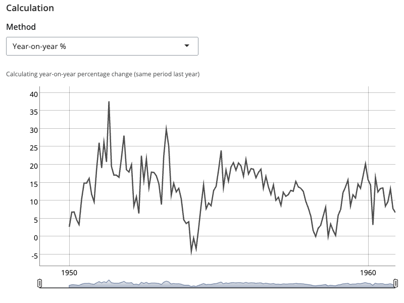
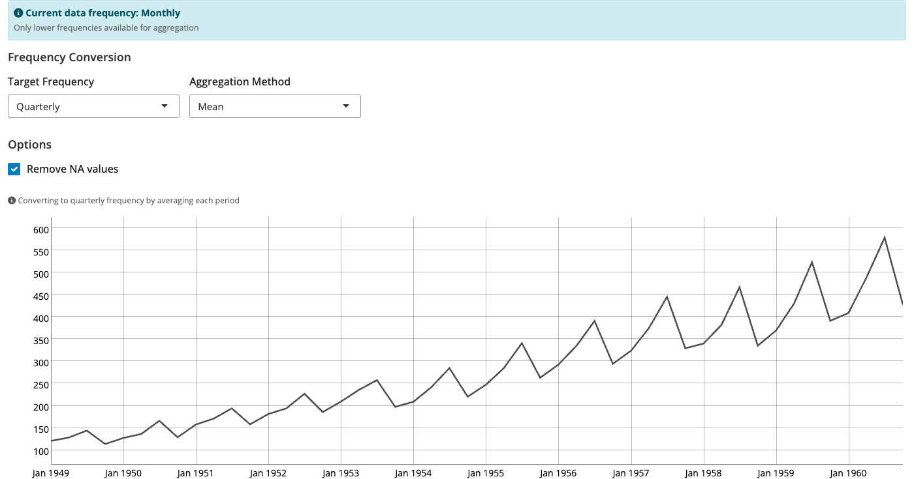
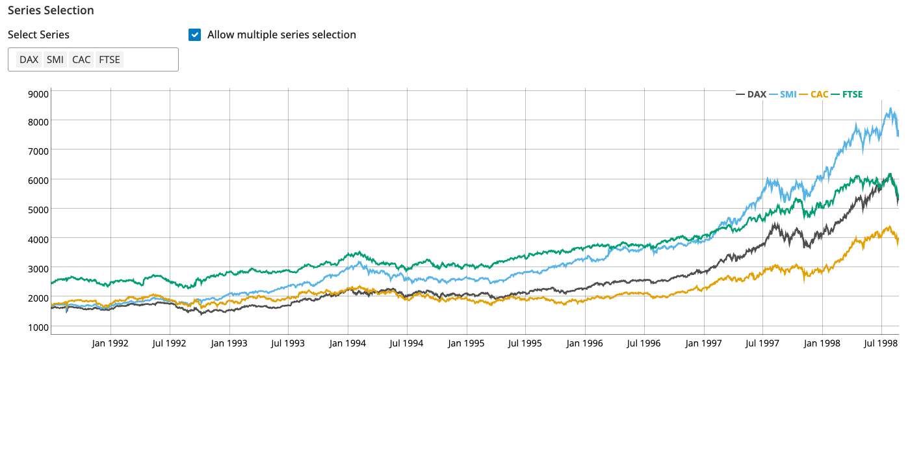
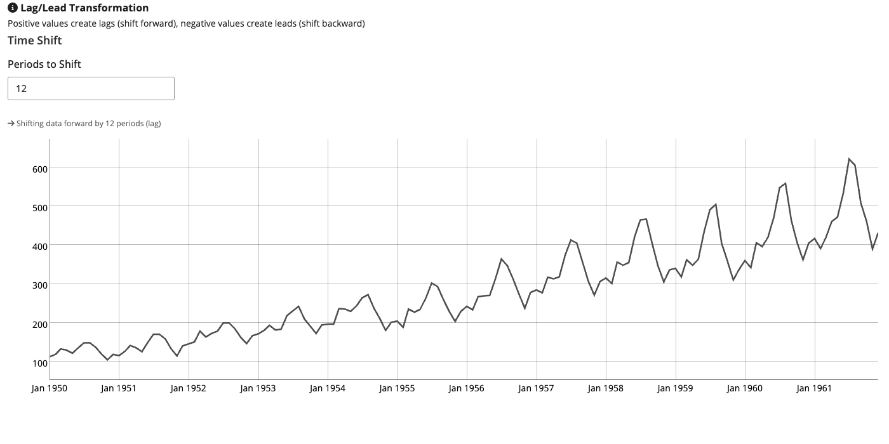
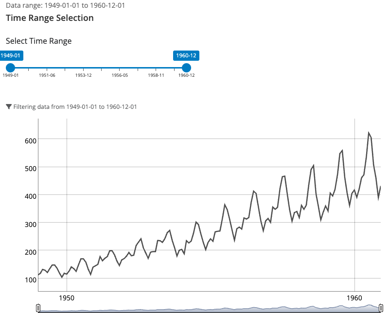
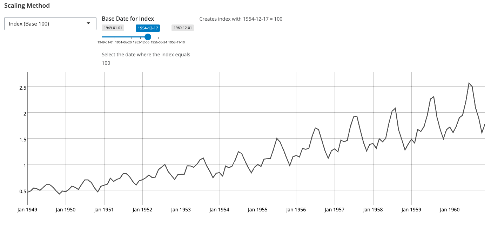
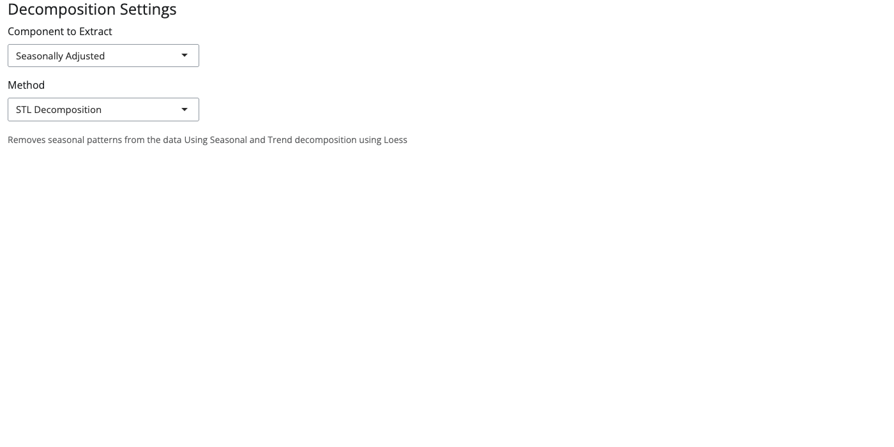
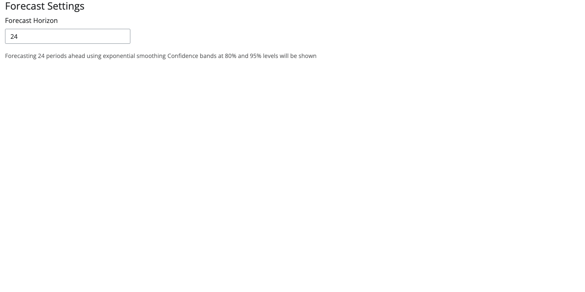
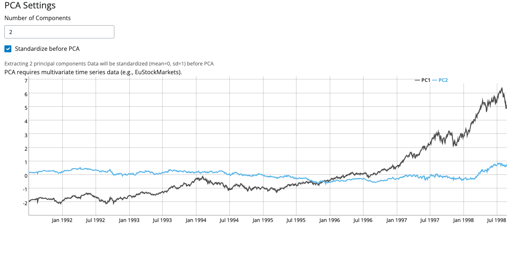

# blockr.ts

**Time Series Analysis Blocks for blockr**

Specialized time series functionality for blockr using tsbox and dygraphs. Provides comprehensive blocks for loading, transforming, and visualizing time series data as interactive dygraphs.

## Features

- 📊 **Interactive Dygraphs**: All outputs render as interactive time series charts
- 📦 **25 Built-in Datasets**: Easy access to R's time series datasets
- 🔄 **Comprehensive Transformations**: Changes, frequency conversion, lag/lead, scaling
- 📈 **Advanced Analysis**: Forecasting, decomposition, PCA for multivariate series
- 🎨 **Professional UI**: Consistent design following blockr.ggplot patterns
- 🎯 **tsbox Integration**: Seamless format conversion and manipulation

## Installation

```r
# Install dependencies
install.packages(c("tsbox", "dygraphs", "forecast"))

# Install blockr.core if not already installed
# remotes::install_github("blockr-org/blockr.core")

# Install blockr.ts
devtools::install()
```

## Quick Start

```r
library(blockr.core)
library(blockr.ts)

# Create a pipeline using new_board()
blockr.core::serve(
  new_board(
    blocks = c(
      data = new_ts_dataset_block(dataset = "AirPassengers"),
      transform = new_ts_change_block(method = "pcy")
    ),
    links = c(
      data_to_transform = new_link("data", "transform")
    )
  )
)
```

## Available Blocks

### Data Blocks

#### `new_ts_dataset_block()`
Access all 25 built-in R time series datasets with an intuitive selector.

```r
blockr.core::serve(
  new_ts_dataset_block(dataset = "EuStockMarkets")
)
```


### Transform Blocks

#### `new_ts_change_block()`
Calculate various types of changes: percentage, differences, year-over-year.



```r
blockr.core::serve(
  new_ts_change_block(method = "pcy"),
  data = list(data = tsbox::ts_tbl(datasets::AirPassengers))
)
```

**Methods:**
- `pc`: Period-on-period percentage change
- `pcy`: Year-on-year percentage change
- `pca`: Annualized percentage change
- `diff`: First differences
- `diffy`: Year-on-year differences

#### `new_ts_frequency_block()`
Convert time series between temporal granularities with smart aggregation.



```r
blockr.core::serve(
  new_ts_frequency_block(to = "year", aggregate = "mean"),
  data = list(data = tsbox::ts_tbl(datasets::AirPassengers))
)
```

**Features:**
- Automatic frequency detection
- Smart target selection (only allows aggregation)
- Multiple aggregation methods: mean, sum, first, last, min, max

#### `new_ts_select_block()`
Select specific series from multivariate time series data.



```r
multivariate_data <- tsbox::ts_c(datasets::mdeaths, datasets::fdeaths)

blockr.core::serve(
  new_ts_select_block(series = "mdeaths", multiple = FALSE),
  data = list(data = tsbox::ts_tbl(multivariate_data))
)
```

#### `new_ts_lag_block()`
Shift time series forward (lag) or backward (lead).



```r
blockr.core::serve(
  new_ts_lag_block(by = 12),
  data = list(data = tsbox::ts_tbl(datasets::AirPassengers))
)
```

#### `new_ts_span_block()`
Filter time series to specific date ranges with an intuitive range slider.



```r
blockr.core::serve(
  new_ts_span_block(start = 1950, end = 1955),
  data = list(data = tsbox::ts_tbl(datasets::AirPassengers))
)
```

### Analysis Blocks

#### `new_ts_scale_block()`
Scale, normalize, or index time series for comparison.



```r
blockr.core::serve(
  new_ts_scale_block(method = "index"),
  data = list(data = tsbox::ts_tbl(datasets::AirPassengers))
)
```

**Methods:**
- `normalize`: Scale to mean=0, sd=1
- `index`: Index to base period (100)
- `minmax`: Scale to [0, 1] range

#### `new_ts_decompose_block()`
Extract trend, seasonal, and remainder components.



```r
blockr.core::serve(
  new_ts_decompose_block(component = "seasonal_adjusted"),
  data = list(data = tsbox::ts_tbl(datasets::AirPassengers))
)
```

#### `new_ts_forecast_block()`
Generate forecasts with confidence intervals.



```r
blockr.core::serve(
  new_ts_forecast_block(horizon = 24),
  data = list(data = tsbox::ts_tbl(datasets::AirPassengers))
)
```

#### `new_ts_pca_block()`
Principal Component Analysis for multivariate time series.



```r
blockr.core::serve(
  new_ts_pca_block(n_components = 2),
  data = list(data = tsbox::ts_tbl(datasets::EuStockMarkets))
)
```

#### `new_ts_to_df_block()`
Convert time series data to regular data frame format, removing the dygraph visualization. Useful for integrating with non-TS blocks or exporting data.

```r
blockr.core::serve(
  new_ts_to_df_block(format = "long"),
  data = list(data = tsbox::ts_tbl(tsbox::ts_c(datasets::mdeaths, datasets::fdeaths)))
)

blockr.core::serve(
  new_ts_to_df_block(format = "wide"),
  data = list(data = tsbox::ts_tbl(tsbox::ts_c(datasets::mdeaths, datasets::fdeaths)))
)
```

#### `new_ts_from_df_block()`
Convert wide-format data frames to time series format with dygraph visualization. Automatically detects time columns and converts numeric columns to separate series.

```r
df_wide <- data.frame(
  date = seq(as.Date("2020-01-01"), by = "month", length.out = 24),
  sales = rnorm(24, 100, 10),
  revenue = rnorm(24, 1000, 100),
  costs = rnorm(24, 500, 50)
)

blockr.core::serve(
  new_ts_from_df_block(),
  data = list(data = df_wide)
)
```

### Building Pipelines

The recommended approach uses `blockr::run_app()` with `blockr.dock` for the modern dock-based UI with the DAG extension:

#### Simple Pipeline

```r
library(blockr)
library(blockr.ts)

run_app(
  blocks = c(
    data = new_ts_dataset_block(dataset = "AirPassengers"),
    change = new_ts_change_block(method = "pcy")
  ),
  links = list(from = "data", to = "change", input = "data")
)
```

#### Comprehensive Time Series Workflow

A full analysis pipeline demonstrating multiple transformations:

```r
library(blockr)
library(blockr.ts)

run_app(
  blocks = c(
    data = new_ts_dataset_block(dataset = "EuStockMarkets"),
    select = new_ts_select_block(series = c("DAX", "FTSE")),
    scale = new_ts_scale_block(method = "index"),
    change = new_ts_change_block(method = "pcy"),
    freq = new_ts_frequency_block(to = "quarter", aggregate = "mean")
  ),
  links = list(
    list(from = "data", to = "select", input = "data"),
    list(from = "select", to = "scale", input = "data"),
    list(from = "scale", to = "change", input = "data"),
    list(from = "change", to = "freq", input = "data")
  )
)
```

#### Alternative: Direct serve() approach

For quick testing without the full dock UI:

```r
library(blockr.core)
library(blockr.ts)

blockr.core::serve(
  new_ts_change_block(method = "pcy"),
  data = list(data = tsbox::ts_tbl(datasets::AirPassengers))
)
```

## See Also

- [blockr.core](https://github.com/blockr-org/blockr.core) - Core blockr framework
- [blockr.ggplot](https://github.com/blockr-org/blockr.ggplot) - ggplot2 visualization blocks
- [tsbox](https://www.tsbox.help/) - Time series toolbox
- [dygraphs](https://rstudio.github.io/dygraphs/) - Interactive time series charts