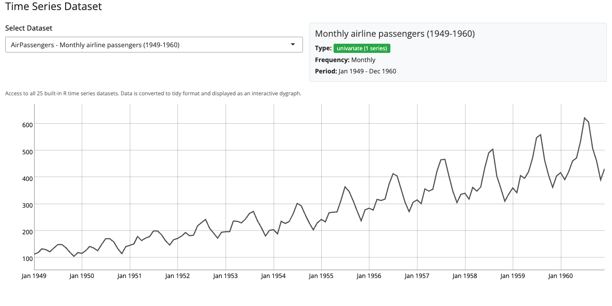

```{r, include = FALSE}
knitr::opts_chunk$set(
  collapse = TRUE,
  comment = "#>",
  echo = FALSE,
  warning = FALSE,
  message = FALSE
)
```

## Introduction

blockr.ts provides interactive blocks for time series analysis and transformation. Each block offers a user interface for a specific time series operation, powered by the tsbox package for seamless format conversion. Blocks can be connected together to create time series analysis pipelines.

All time series blocks automatically render as interactive dygraph visualizations, allowing you to explore your data with zoom, pan, and hover interactions.

---

## AirPassengers Block

The AirPassengers block provides quick access to the classic AirPassengers dataset. This block demonstrates the simplest form of a time series data source.

This block loads monthly totals of international airline passengers from 1949 to 1960. It requires no configuration and immediately displays the data as an interactive dygraph. The data is automatically converted to tsbox's data frame format for compatibility with all transform blocks.

```{r airpassenger-block, out.width="100%", fig.cap="AirPassengers block interface"}
knitr::include_graphics("../man/figures/ts-airpassenger-block.png")
```

---

## Time Series Dataset Block

The dataset block provides access to 25 built-in R time series datasets through a searchable selector. This is the primary data source block for exploring different time series with blockr.ts.

The block includes both univariate series (like AirPassengers, Nile, lynx, co2) and multivariate series (like EuStockMarkets with 4 stock indices, Seatbelts with 8 series). Select a dataset from the dropdown and view its details in the information panel. The panel shows whether the series is univariate or multivariate, the number of observations, and the time range.

For multivariate series, all component series are included in the output. Use the Select block downstream to choose specific series from multivariate data.

```{r dataset-block, out.width="100%", fig.cap="Time series dataset selector"}

```

---

## Change Block

The change block calculates various types of changes and differences in time series data. It provides five transformation methods to analyze how values evolve over time.

Select a method from the dropdown: "pc" for percentage change (period-on-period), "pcy" for year-over-year percentage change, "pca" for annualized percentage change, "diff" for simple difference (absolute change), or "diffy" for year-over-year difference (absolute change from same period last year). Each method compares current values with previous values at the appropriate time lag.

The block dynamically updates its description to explain the selected method. This is particularly useful for economic and financial time series where growth rates and period-over-period changes are key metrics.

```{r change-block, out.width="100%", fig.cap="Change block interface"}
knitr::include_graphics("../man/figures/ts-change-block.png")
```

---

## Frequency Block

The frequency block converts time series between different temporal granularities. Use this to aggregate data from higher to lower frequencies, such as converting monthly data to quarterly or yearly.

The block automatically detects your input data's frequency and restricts the target dropdown to only show valid lower frequencies. You cannot disaggregate to higher frequencies. Select an aggregation method (mean, sum, first, last, min, max) to control how values are combined during the conversion.

An info box displays the current detected frequency. This is essential for preparing data for analysis or visualization at different time scales, or for aligning series with different native frequencies.

```{r frequency-block, out.width="100%", fig.cap="Frequency conversion block"}
knitr::include_graphics("../man/figures/ts-frequency-block.png")
```

---

## Select Block

The select block chooses specific series from multivariate time series data. This block is designed specifically for working with data that contains multiple component series.

The block automatically detects which series are available in your data and provides a multi-select dropdown to choose which ones to keep. You can select one or more series. The block defaults to selecting all available series when first initialized.

For univariate data (single series), the block displays an informative message explaining that series selection is only meaningful for multivariate data. Try this block with multivariate datasets like EuStockMarkets or Seatbelts to see the full functionality.

```{r select-block, out.width="100%", fig.cap="Series selection block"}
knitr::include_graphics("../man/figures/ts-select-block.png")
```

---

## Lag Block

The lag block shifts time series forward (lag) or backward (lead) by a specified number of periods. This is useful for analyzing relationships between current and past values, or for creating lagged predictors.

Enter the number of periods to shift in the numeric input. Positive values create lags (shift forward in time), while negative values create leads (shift backward in time). The block dynamically updates its description to show whether you're lagging or leading the data.

An info box explains the convention: positive values lag the data, negative values lead it. This transformation is essential for time series modeling where you need to include past values as predictors, or for creating lead-lag plots to visualize temporal relationships.

```{r lag-block, out.width="100%", fig.cap="Lag transformation block"}
knitr::include_graphics("../man/figures/ts-lag-block.png")
```

---

## Span Block

The span block filters time series to specific date ranges. Use this to focus analysis on particular time periods or to exclude data outside a region of interest.

The block displays a double-ended range slider that adapts to your data's frequency. For monthly data, the slider moves in monthly increments. For yearly data, it moves in yearly increments. The date format also adjusts to match the data frequency for clear readability.

An info box shows the full data range available. You can adjust the start date, end date, or both. Partial ranges are supported: set only a start date to filter from that point forward, or only an end date to filter up to that point. The slider provides intuitive visual feedback for the selected range.

```{r span-block, out.width="100%", fig.cap="Time range selection block"}
knitr::include_graphics("../man/figures/ts-span-block.png")
```

---

## Building Time Series Pipelines

Connect multiple blocks together to create complete time series analysis pipelines. For example:

1. Start with a Dataset block to load EuStockMarkets
2. Add a Frequency block to convert daily data to monthly
3. Add a Select block to focus on specific indices
4. Add a Change block to calculate year-over-year percentage changes
5. Add a Span block to analyze a specific time period

Each block transforms the data and passes it to the next block. All intermediate results are visualized as interactive dygraphs, allowing you to inspect your pipeline at every step.

---

## Interactive Visualization

All blockr.ts blocks use dygraphs for visualization, providing:

- **Zoom**: Click and drag to zoom into a specific time range
- **Pan**: Hold Shift and drag to pan across time
- **Hover**: Mouse over the graph to see exact values
- **Range Selector**: Use the small navigator chart below the main plot to select date ranges
- **Consistent Colors**: All plots use the professional tsbox color palette

The dygraph visualization is generated automatically from the block output. You don't need to configure anything - just connect your blocks and explore your data interactively.
